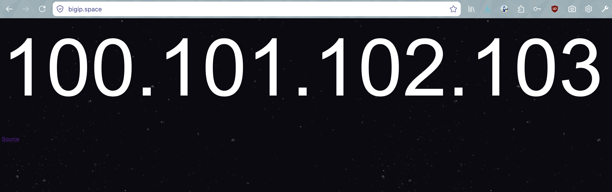

# What is this?

A simple page that shows your IP address. In a big font. In space!

# What does it look like?

# How do I use it?

[Check it out here!](https://bigip.space)

# Can I use the command line?

Sure thing. `curl https://bigip.space` works just fine, and so does `curl bigip.space`, if you don't mind simple http.
